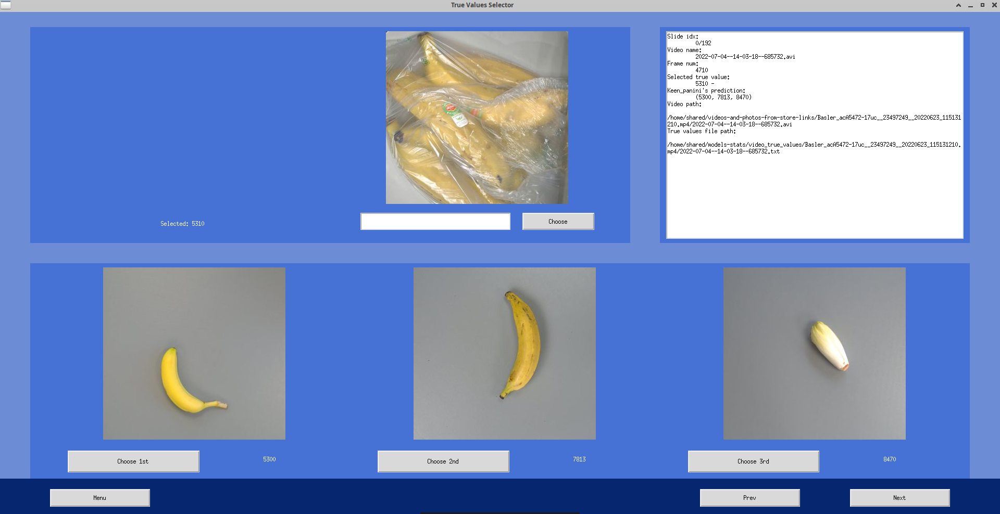

# True-Values-Selector
This programm was written to fix wrong selected true values.

To start it open terminal and bash start.sh with correct args.

`json_path`-path to json file that creates after every model test.

`all_classes_photos` - path to all classes photos.

